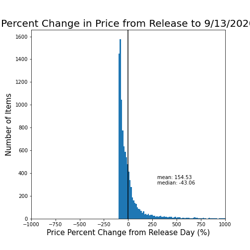
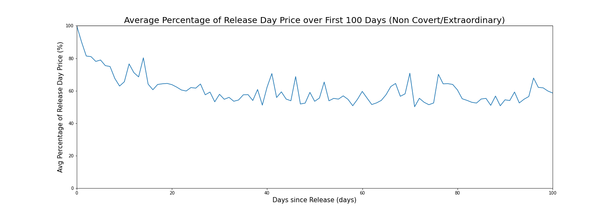
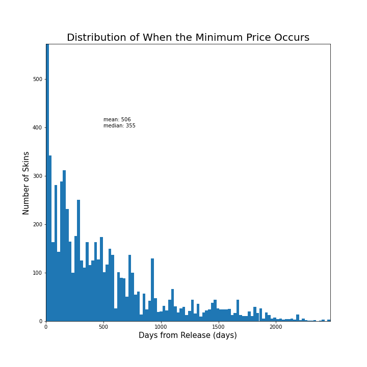

#  Analysis on the Counter Strike: Global Offensive Economy
*Written by whuang37 on September 25, 2020*  
*Investigating market trends and potential trading techniques*

This project was driven by an interest and curiosity in the Counter Strike: Global Offensive skin market that began nearly 6 years ago when I began trading skins. I spent hours upon hours tracking prices, browsing trading forums, trading, and, as much as I hate to say it now, gambling to learn more about the market and build the skin inventory of my dreams. As I learned more of the market, new questions kept arising. Why were certain skins worth so much? How did the M4A4 Griffin's price change in the long term after the artwork fiasco? What drives change in the economy? Eventually, I lost interest in the game and the economy, but I never forgot those burning questions I had. Now, 6 years later, I want to finally answer them. 

By no means am I an expert on data analysis, Python, or the Counter Strike: Global Offensive skin economy. Quite the contrary actually. This project is my first real foray into data analysis with Python. It has also been years since I seriously traded skins and examined the economy. Thus, some of the code or analysis you see may be poorly written. If you have any unanswered questions you want answered, corrections, or critiques on any of my analysis, conjectures, or code please feel free to contact me!

# What is Counter Strike: Global Offensive?

Counter Strike: Global Offensive (CSGO) is a multiplayer first-person shooter game and the latest entry in the Counter Strike series developed by Valve and Hidden Path Entertainment. CSGO matches feature 10 players split into two teams called Counter-Terrorists and Terrorists played over a series of rounds. Teams attempt to complete objectives (destroying a bombsite/rescuing a hostage) or eliminate the enemy team in order to win the round. Despite the games age and past slumps in popularity, CSGO has seen a recent surge in popularity attributed partly to the increased Chinese interest, the free to play model, and the skin market, the subject of this project.

# The Skin Market

As has become standard in many Valve games, CSGO has a virtual economy where players can exchange real world money for weapon skins and other items. Skins and other items have no effect on the gameplay of CSGO and simply **change the cosmetic design** of weapons, character models, and end-of-round messages. These items are primarily implemented into the game through cases, loot boxes opened with a $2.49 key that contains one of a collection of skins with different rarities, that can be randomly dropped as the player levels up in-game. Players can also earn skins at the end of every match, through battle pass like events called operations, the in-game store, trading with other players, and websites, both first and third party, that specialize in selling different virtual items. 

One of these sites is the [Steam Community Market](https://steamcommunity.com/market/), the source of all data used in this project, is a first party community market where users can list their skins and items for steam credit. The Steam Community Market has become one of the go-to sites to measure a skins price, which can fluctuate and vary from item to item. Scarcity and demand can drive item prices into the thousands of dollars! How does this market react to different changes and major events? How do prices change over time? And, of course, how can we be better CSGO traders and investors? Let's find out!

# About the Data

For this project, I collected the market history data for 15,917 items with 10,281 of these items being weapon skins, knives, or gloves, 3,600 being stickers, and 2,036 being other items like cases, keys, agents, and music kits. This is a comprehensive list of all items on [csgostash.com](https://csgostash.com), a website listing all CSGO skins, as of September 13, 2020. Some items may be missing due to human error or the item being too rare to be listed on the Community Market or [csgostash.com](https://csgostash.com). This sampling is, however, large enough to paint a relatively accurate picture of the CSGO skin market and make conjectures on market trends and potential trading strategies. All data is taken directly from Steam queries from **August 1, 2020 - September 13, 2020** (more on this later). 

# Collecting Data

I collected the market history from steam in a two step process. I first queried a series of different webpages on [csgostash.com](https://csgostash.com) to get an overarching DataFrame of all possible items and skins. These DataFrames were then saved to .xlsx files (.xlsx used over .csv to preserve the special characters in some skins) for use in querying the steam market. Learn more about this process on the Jupyter notebook used to create these files found [here](https://github.com/whuang37/csgo_market/blob/master/pull_skin_names.ipynb). 

With this list of items and skins, we can query each row for the day-by-day median price and volume sold data through sending JSON get requests. These requests are sent to:
  
  
`https://steamcommunity.com/market/pricehistory/?country=*COUNTRY*&currency=*CURRENCY*&appid=*APPID*&market_hash_name=*HASHED_NAME*`

`country = your preferred country (ie US)`

`currency = your preferred currency (ie USD)`

`appid = the id of the game you are querying (ie CSGO's appid: 730)`

`hashed_name = the name of the item you are querying with symbols converted to ASCII (ie CZ75-Auto%20%7C%20Emerald%20%28Minimal%20Wear%29)`

This get request returns the data in a json format which is cleaned and saved in the Jupyter notebook found [here](https://github.com/whuang37/csgo_market/blob/master/get_market_history.ipynb). The data created in this notebook is the subject of the following analyses.

# Data Analysis on Skins and Knives
All of the data analysis here focuses on data on the 10,281 skins and knives. Stickers and other items are left out as they do not always behave the same way as these items. As we'll find out, there is massive variation even inside just skins and knives.

Originally the data was taken from August 1, 2020 to September 14, 2020. However, I found that data for September 14, 2020 was incomplete at the time I was scraping data so I cut the range to what it is now.

## Qualities, Types, and Conditions

|Skin Qualities | Skin Types | Skin Conditions |
|:---:|:---:|:---:|
|  |  |  |

Skins and knives are broken up into a series of different categories. Each skin has a quality, which dictate an items rarity. Consumer Grade and Industrial Grade skins are dropped normally by playing the game. The rest, apart from Contraband, are solely found through opening crates. Covert quality items correspond to normal covert weapon skins **AND** knives and Extraordinary quality items solely correspond to different gloves. Contraband items, which will be covered in more depth later, are items that have been discontinued due to one reason or another. Many of these items include stolen pieces of artwork which Valve has subsequently pulled from the game. Most of these values make sense in relationship to their rarity other than Covert items. The sheer amount of different knives and rare skins make up nearly a third of all skins in the game. Pretty insane for items that should have a drop rate of 0.25%.

Skins also can come in three main variants, a normal skin with no extras, a StatTrak™ (ST) skin which counts the number of kills you get with that particular weapon, and Souvenir skins which commemorate a CSGO Tournament. There is about a 10% chance of getting a ST variant of a skin through a case which explains its smaller percentage. Souvenir skins can only be earned from special Souvenir Packages given to random viewers of that particular tournament. 

Finally, skins also have a wear which dictates how beat up the artwork/design on the skin is. This wear is often referred to by a float value, a decimal value that dictates how worn the skin is. Floats are split into 5 main categories. Although some skins can only come in certain wears, this evens itself out with each condition commanding approximately a 20% share of the overall market.

## General Market History Information

| Metric | average ± SD | 
|:--- |:---|
| Market Price | $80.51 ± 169.59 |
| Daily Volume | 81.609 ± 197.944 | 

To begin, I took some basic measurements on the average market price and daily volume sold of skins and knives. It immediately becomes apparent that expensive, low volume knives and skins heavily influence the mean as seen through the massive standard deviations on both the average price and daily volume. The high average market price can be further explained by the large market share Covert skins take up, many of which are worth hundreds of dollars. I suspect the average market price could be **even higher** if the Steam Community Market had not capped prices at $400 until early 2017. This is not even mentioning that many of the expensive skins are actually traded and sold on third-party websites.

These metrics are daunting. The massive spread in the data means that many of the conjectures and analyses made in this project will have to be taken with a grain of salt. It is simply impossible to predict market trends when some items are worth pennies while others are worth thousands of dollars. 

## Location of Market Activity

With a data spread this large, it begs the question where is the majority of the market activity taking place? Most CSGO players can not possibly be willing to spend $80+ on what is essentially some pixels.

The short of it is that the majority of trading and market activity do not occur anywhere near the average price of the market. By calculating the volume weighted average price (VWAP), a trading benchmark normally used to provide insight into trends and values of different securities, we find that the VWAP is only **$2.03**, indicating that a majority of trading actually occurs in the cheaper items. This only furthers the idea that the market price is heavily skewed by the sheer amount of rare and expensive skins.

## Price Appreciation

Unsurprisingly, its hard to say from a first glance. I began by taking the average percent change between the price of an item on release and its price on September 13, 2020. In this calculation, I found a mean percent change of 154.53% but a median percent change of -43.06%. Once again, the wide spread of the data and large amounts of high price and low volume skins makes it difficult to make any conjectures from basic analyses.

I then took the average price for every day after launch and calculated its percent change compared to the release day price. This is where things get interesting. Here, we see a clear upwards trends in a skins price as the skin gets older, **indicating some sort of price appreciation as a skin ages**. In the all skins line, theres a series of sawtooth like trends around certain areas. Originally, I thought these patterns were a result of age differences between different items. By separating knives and gloves from normal gun skins, however, it becomes clear that those trends were most likely due to wild fluctuation in the price of knives and gloves. 

Just because the price does appreciate does not mean you'll make money by buying from launch. In normal gun skins, the price of most items falls drastically immediately after launch, averaging at -41.12 ± 8.44% (This is one of the smallest standard deviations calculated so far) percent change from release day for the first year after launch. Even across a skin's entire lifespan, the percent change averages at -22.26 ± 42.18% with a median of -33.38%. **Buying in on a skin's release has a high likelihood of ending in major losses**. The percent change stays negative for 1751 days (nearly 5 years!) after release, where it finally breaks 0% change. **If you buy in on release, expect to wait 5 years or more to recuperate your losses**. Furthermore, most of the CSGO skins that are over 5 years old have been discontinued or do not drop anymore, potentially increasing their value and causing the steep trend upward past 2000 days from release.

If you do plan on investing on a skin's release date, buy knives and gloves. **Both knives and gloves rarely fall below release price over their entire lifetimes, with an average percent change of 55.84 ± 75.2% and a median of 27.66%**. The scarcity and demand for these items mean that atleast you wont lose 40% of your investment in the first year of buying in.

## When to Buy In

*NOTE all analyses done in the When to Buy In section cover only gun skins. Knives and gloves fluctuate far too much to make any reasonable conjecture on them*

CSGO skins tend to sell for astronomical prices upon release due to the demand to get the latest skins. This is apparent in the appreciation graphs which shows that many skins immediately drop 50% of their value almost on launch. This begs the question as to when should you buy in?

If you can't wait and want the newest skins immediately, gun skins tend to drop the most in the first 20 - 30 days post release. Buy in then! If you simply can not bear the wait, giving it 24 hours before buying the newest skin can mean you save around 9.88% of what you would have paid.

However, what if you were investing? By graphing the number of days it takes for a skin to reach its minimum price, we get a mean of 506 ± 491 days and a median of 355 days. Although the massive spread of data makes it difficult to make any concrete assumptions, in general, **the minimum price of an item occurs in the first 3 years of its lifespan**.

I then calculated the profits if you were to buy in on each day after an item's release and sold your investment on September 13, 2020. Again, we see that buying in between one to three years post release yields the greatest profits, with some investments possibly growing over 4x its value! By applying a linear regression, we see that for every day a skin is released, the potential profits decrease by about .11%. This data also **indicates that buying into old and discontinued skins can be profitable**. These investments will not yield as much as buying in in the first few years of a release, but grow at a relatively linear rate. 

# When to Sell

To preface, if you by some chance come across a newly released item, **sell it immediately**. As we saw previously, prices drastically decrease in the first 20 days of a skin's lifespan and continue to decrease for the forecoming year. 
