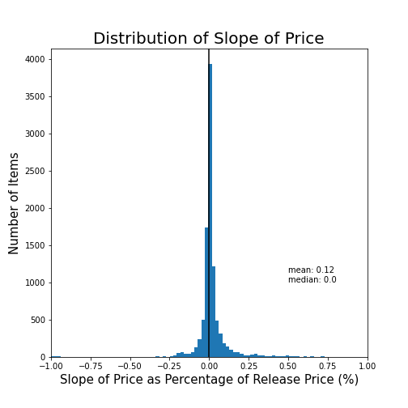
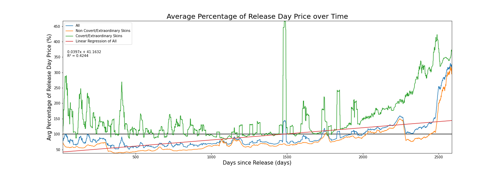
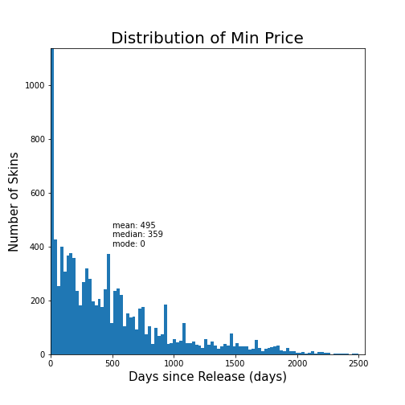
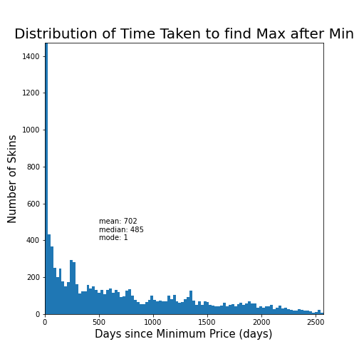
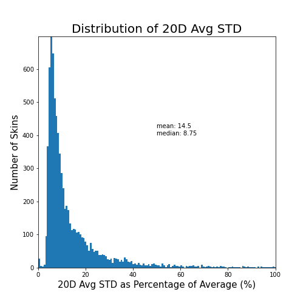
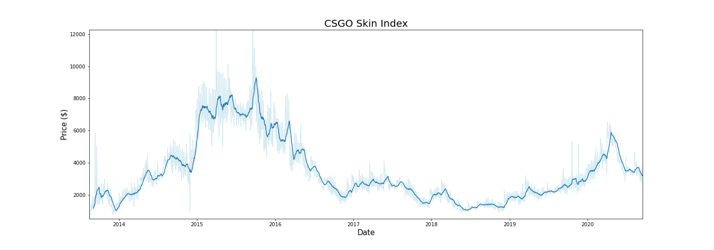

--- 
layout: single
author_profile: true
title: Analysis on the CSGO Economy
classes: wide
---
#  Analysis on the Counter Strike: Global Offensive Economy
*Written by whuang37 on September 25, 2020*  
*Investigating market trends and potential trading techniques*

This project was driven by an interest and curiosity in the Counter Strike: Global Offensive skin market that began nearly 6 years ago when I began trading skins. I spent hours upon hours tracking prices, browsing trading forums, trading, and, as much as I hate to say it now, gambling to learn more about the market and build the skin inventory of my dreams. As I learned more of the market, new questions kept arising. Why were certain skins worth so much? How did the M4A4 Griffin's price change in the long term after the artwork fiasco? What drives change in the economy? Eventually, I lost interest in the game and the economy, but I never forgot those burning questions I had. Now, 6 years later, I want to finally answer them. 

By no means am I an expert on data analysis, Python, or the Counter Strike: Global Offensive skin economy. This project is my first real foray into data analysis with Python. It has also been years since I seriously traded skins and examined the economy. Thus, some of the code or analysis you see may be poorly written. If you have any unanswered questions you want answered, corrections, or critiques on any of my analysis, conjectures, or code please feel free to contact me!

# What is Counter Strike: Global Offensive?

Counter Strike: Global Offensive (CSGO) is a multiplayer first-person shooter game and the latest entry in the Counter Strike series developed by Valve and Hidden Path Entertainment. CSGO matches feature 10 players split into two teams called Counter-Terrorists and Terrorists played over a series of rounds. Teams attempt to complete objectives (destroying a bombsite/rescuing a hostage) or eliminate the enemy team in order to win the round. Despite the games age and past slumps in popularity, CSGO has seen a recent surge in popularity attributed partly to the increased Chinese interest, the free to play model, and the skin market, the subject of this project.

# The Skin Market

As has become standard in many Valve games, CSGO has a virtual economy where players can exchange real world money for weapon skins and other items. Skins and other items have no effect on the gameplay of CSGO and simply **change the cosmetic design** of weapons, character models, and end-of-round messages. These items are primarily implemented into the game through cases, loot boxes opened with a $2.49 key that contains one of a collection of skins with different rarities, that can be randomly dropped as the player levels up in-game. Players can also earn skins at the end of every match, through battle pass like events called operations, the in-game store, trading with other players, and websites, both first and third party, that specialize in selling different virtual items. 

One of these sites is the [Steam Community Market](https://steamcommunity.com/market/) is a first party community market where users can list their skins and items for steam credit and the source of all data used in this project. The Steam Community Market has become one of the go-to sites to measure a skins price, which can fluctuate and vary from item to item. Scarcity and demand can drive item prices into the thousands of dollars! How does this market react to different changes and major events? How do prices change over time? And, of course, how can we be better CSGO traders and investors? Let's find out!

# About the Data

For this project, I collected the market history data for 15,917 items with 10,281 of these items being weapon skins, knives, or gloves, 3,600 being stickers, and 2,036 being other items like cases, keys, agents, and music kits. This is a comprehensive list of all items on [csgostash.com](https://csgostash.com), a website listing all CSGO skins, as of September 13, 2020. Some items may be missing due to human error or the item being too rare to be listed on the Community Market or [csgostash.com](https://csgostash.com). This sampling is, however, large enough to paint a relatively accurate picture of the CSGO skin market and make conjectures on market trends and potential trading strategies. All data is taken directly from Steam queries from **August 1, 2020 - September 13, 2020** (more on this later). 

# Collecting Data

I collected the market history from steam in a two-step process. I first queried a series of different webpages on [csgostash.com](https://csgostash.com) to get an overarching DataFrame of all possible items and skins. These DataFrames were then saved to .xlsx files (.xlsx used over .csv to preserve the special characters in some skins) for use in querying the steam market. Learn more about this process on the Jupyter notebook used to create these files found [here](https://github.com/whuang37/csgo_market/blob/master/pull_skin_names.ipynb). 

With this list of items and skins, we can query each row for the day-by-day median price and volume sold data through sending JSON get requests. These requests are sent to:
  
  
`https://steamcommunity.com/market/pricehistory/?country=*COUNTRY*&currency=*CURRENCY*&appid=*APPID*&market_hash_name=*HASHED_NAME*`

`country = your preferred country (ie US)`

`currency = your preferred currency (ie USD)`

`appid = the id of the game you are querying (ie CSGO's appid: 730)`

`hashed_name = the name of the item you are querying with symbols converted to ASCII (ie CZ75-Auto%20%7C%20Emerald%20%28Minimal%20Wear%29)`

This get request returns the data in a json format which is cleaned and saved in the Jupyter notebook found [here](https://github.com/whuang37/csgo_market/blob/master/get_market_history.ipynb). The data created in this notebook is the subject of the following analyses.

# Data Analysis on Skins and Knives
All of the data analysis here focuses on data on the 10,281 skins and knives. Stickers and other items are left out as they do not always behave the same way as these items. As we'll find out, there is massive variation even inside just skins and knives.

Originally the data was taken from August 1, 2020 to September 14, 2020. However, I found that data for September 14, 2020 was incomplete at the time I was scraping data so I cut the range to August 1, 2020 to September 13, 2020.

## Qualities, Types, and Conditions

|Skin Qualities | Skin Types | Skin Conditions |
|:---:|:---:|:---:|
|  |  |  |

Skins and knives are broken up into a series of different categories. Each skin has a quality, which dictate an item’s rarity. Consumer and Industrial Grade skins are dropped normally by playing the game. The rest, apart from Contraband, are solely found through opening crates. In this dataset, Covert quality items correspond to normal covert weapon skins **AND** knives and Extraordinary quality items solely correspond to different gloves. Contraband items, which will be covered in more depth later, are items that have been discontinued due to one reason or another. Many of these items include stolen pieces of artwork which Valve has subsequently pulled from the game. Most of these values make sense in relationship to their rarity other than Covert items. The sheer amount of different knives and rare skins make up nearly a third of all skins in the game. Pretty insane for items that should have a drop rate of 0.25%.

Skins also can come in three main variants, a normal skin with no extras, a StatTrak™ (ST) skin which counts the number of kills you get with that skin equipped, and Souvenir skins which commemorate a CSGO Tournament. There is about a 10% chance of getting a ST variant of a skin through a case which explains its smaller percentage. Souvenir skins can only be earned from special Souvenir Packages given to random viewers of that tournament, explaining it rarity. 

Finally, skins also have a wear which dictates how damaged the artwork/design on the skin is. This wear is often referred to by a float, a decimal value that dictates how worn the skin is. Floats are split into 5 main categories that comprise the different conditions listed on each skin. Although some skins can only come in certain conditions (ie. the P250 Metallic DDPAT does not have BS, WW, or FT), this evens itself out with each condition commanding approximately a 20% share of the overall market.

## General Market History Information

| Metric | average ± SD | 
|:--- |:---|
| Market Price | $80.51 ± 169.59 |
| Daily Volume | 81.609 ± 197.944 | 

To begin, I took some basic measurements on the average market price and daily volume sold of skins and knives. It immediately becomes apparent that expensive, low volume knives and skins heavily influence the mean as seen through the massive standard deviation on both the average price and daily volume. The high average market price can be further explained by the large market share Covert skins take up, many of which are worth hundreds of dollars. I suspect the average market price could be **even higher** if the Steam Community Market had not capped prices at $400 until early 2017. This is not even mentioning that many of the expensive skins are traded and sold on third-party websites instead of the Steam Community Market.

These metrics are daunting. The massive spread in the data means that many of the conjectures and analyses made in this project will have to be taken with a grain of salt. It is simply impossible to predict market trends when some items are worth pennies while others are worth thousands of dollars. 

## Location of Market Activity

With a data spread this large, it begs the question of where most of the market activity is taking place. Most CSGO players cannot possibly be willing to spend $80+ on what is essentially some pixels…right?

The short of it is that most of the trading and market activity do not occur anywhere near the average price of the market. To find this, I calculated the volume weighted average price (VWAP), a trading benchmark normally used to provide insight into trends and values of different securities. VWAP is calculated by summing all the prices multiplied by its respective trading volume and then dividing this number by the total volume of items sold. With this calculation, we find that the VWAP is only **$2.03**, indicating that a majority of trading actually occurs in the cheaper items. This only furthers the idea that the market price is heavily skewed by the sheer amount of rare and expensive skins.

## Price Appreciation

In order to account for the more expensive items which can have larger day-by-day fluctuations in price compared to cheaper items, all the calculations done in the following section are expressed as a percentage of the release day price. This provides a more meaningful indicator on how an investment might grow over time.

Unsurprisingly, it is hard to say from a first glance. I began by taking the price percent change between the price of an item on release and its price on September 13, 2020. In this calculation, I found a mean percent change of 154.53% but a median percent change of -43.06%. Once again, the wide spread of the data and large amounts of high price and low volume skins makes it difficult to make any conjectures from basic analyses.

Instead of calculating just the percentage between the release date and now, I took the slope of a linear regression of the sale price as a percentage of the release price over time. Here, we find a mean slope of .12 ± 3.45% and a median of 0.00. This metric seems to yield more promising results, as 57.52% of all skins have a positively sloped linear regression. This data suggests that that a large portion of items **will appreciate over time**. Again, it is important to note that **the wide spread of this data lead to large tails in the data**. 

I then took the average price for every day after launch and calculated that value as a percentage of the release day price. At 100%, the skin is worth the same as it was on the day of its release. This is where things get interesting. Here, we see a clear upwards trends in a skins price as the skin gets older, as seen through the positively sloped linear regression (R² = .4244), **indicating some sort of price appreciation as a skin ages**. While examining the graph, I noticed a series of sawtooth like patterns in the all skins line. Originally, I thought these patterns were a result of age differences between different items. However, after separating Covert/Extraordinary skins (mostly knives and gloves) from normal gun skins, it becomes apparent that those trends were most likely due to wild fluctuation in the price of Covert/Extraordinary skins. 

Just because the price does appreciate does not mean you'll make money by buying from launch. In non-Covert/Extraordinary skins, the price of most items falls drastically immediately after launch to a mean of 58.83 ± 8.45% (This is one of the smallest standard deviations calculated so far) of the release day price for the first year after launch. This value does grow to a mean of 77.70 ± 42.22% with a median of 66.55% of the release day price in a skin over the course of a skins lifespan, but still far from the release day price. With all this data in mind, **Buying in on a skin's release has a high likelihood of ending in major losses**. The average price of a skin stays below the release price for 1751 day (nearly 5 years) after release, where it finally breaks the release price. **If you buy in on release, expect to wait 5 years or more to recuperate your losses**. Furthermore, most of the CSGO skins that are over 5 years old have been discontinued or do not drop anymore, potentially increasing their value and causing the steep trend upward past 2000 days from release.

If you do plan on investing on a skin's release date, buy Covert/Extraordinary skins. **Covert/Extraordinary skins rarely fall below release price over their entire lifetimes**, with an average skin worth a mean of 155.52 ± 75.21% and a median of 127.60% of the release day price. The scarcity and demand for these items help these items avoid the steep drop off in price seen in other weapon skins after launch. Keep in mind, these items are scarcely sold on the Community Market and can thus be missed by this analysis.

*20 Day Moving Average Applied*

## When to Buy In

CSGO skins tend to sell for astronomical prices upon release due to the demand to get the latest skins. This is apparent in the appreciation graphs which shows that many skins immediately drop 50% of their value almost on launch. This begs the question as to when should you buy in?

If you can't wait and want the newest skins immediately, **non-Covert/Extraordinary skins tend to drop the most in the first 20 - 30 days post release**. Buy in then! If you simply cannot bear the wait, even waiting just 24 hours before buying the newest skin can mean you save an average of 9.88% of what you would have paid on release. 

*NOTE these are non-Covert/Extraordinary skins only*

When it comes to Covert/Extraordinary skins, **there does not seem to be a perfect time to buy in**. As seen in the previous analyses on appreciation, these skins tend to fluctuate around and above the release price up until the 5-year mark where they grow drastically, most likely due to their collections being discontinued.

However, what if you were investing? By graphing the number of days it takes for a skin to reach its minimum price, we get a mean of 495 ± 480 days and a median of 359 days. Of all these skins, 50.38% had their minimum price occur in the first year of their lifespan while 37.84% of these skins had their minimum price occur between the first and third year of their lifespan. Keep in mind, 4.59% of these skins had their minimum price occur on launch day (x = 0). Given the fact that skin prices do tend to appreciate to some degree, especially after being on the market for more than 5 years, **it makes the most sense to buy into a skin that has been on the market for less that three years**.

*NOTE A mode of zero means that the mode occurred on release date*

## When to Sell

To preface, if you by some chance come across a newly released item, **sell immediately**. As we saw previously, prices drastically depreciate in the first 20 days of a skin's lifespan and continue to decrease for the forthcoming year. 

In graphing the distribution of when the maximum price of an item occurs, we get a mean of 656 ± 820 days and a median of 210 days. Here, we see just how important it is to sell as early as possible in a skin's lifespan. Of all 10281 skins, 27.74% of them had their maximum price occur on release day! After the initial release, there is a relatively constant amount of skins reaching their maximum price per day. This comes out to a mean of 3 ± 8 skins hitting their maximum per day. As interesting as this is, it does not really tell us when to sell.

Obviously, we cannot travel back in time to sell our skins on the day of launch, so how long should we wait before selling? I attempted to answer this question by taking the time between an item's minimum price and its next maximum price, finding a mean of 702 ± 677 days and a median of 485 days between the day of an item's minimum price and its next maximum price. Of all these skins, 43.48% of them had maximum occur within one year of the minimum. This may indicate that **long term selling may not be the most profitable way of investing**. Many skins are likely to hit their maximum relatively soon after hitting their minimum, meaning that investors should sell more aggressively if a large maximum occurs. **A major caveat here is that the age of skins all differs wildly, meaning that they can find a new maximum price in the future**. 

## Volatility 

While analyzing the price appreciation of CSGO skins, it becomes apparent that skin prices are extremely volatile. By calculating the average 20-day standard deviation expressed as a percentage of the 20 day moving average (STD), we can generate a metric to analyze how volatile skins are. On average, skins have a STD of 14.50 ± 17.06% and a median of 8.75%. **This indicates that skin prices are indeed very volatile**. Perhaps we can use this to our advantage...

## Potential Trading Strategy: Swing Trading

With volatility this high, there is potential to swing trade in the CSGO skin economy. Swing trading in traditional stocks involves taking short term trades (length between a few days and a few months) to profit from price moves. Most swing traders attempt to simply capture a portion of a price move and profit accordingly. The first thing you should do before even starting is enable the Steam Mobile Authenticator for at least 7 days. Without the Authenticator enabled, items will be held for 15 days before actually being listed to sell. This may mean you miss out on profitable price swings. 

We must keep in mind that Steam takes a 15% cut of the market price of an item when selling on the Steam Community Market. For cheaper items, this is even more as there is a minimum cut of $0.02. In order to mitigate this, we want to trade with items that have a high enough volatility to cover this cut and subsequently profit. Theoretically, it would be relatively likely for an item to bounce between one STD below the average price and one STD above the average price. Since the STD is expressed as a percentage of the MA in this case, we can call the MA 100%.

$.85(100 + STD) > 100 - STD$ $85 + .85STD > 100 - STD$ $STD > 8.108$

There are 4203 skins, making up 40.88% of all skins, that have a STD greater than 8.11%. This is, however, the bare minimum to just break even. Ideally these items have a STD over 10% for some sort of profit. In these 4203 skins, only 1961, or 46.66%, have an average daily volume above 100 skins and only 818, or 19.46%, skins have an average daily volume above 100 skins and an average price above $0.50. Most of these skins are Restricted, Mil-Spec, or Classified quality skins. Most of the Covert, Industrial Grade, and Consumer Grade quality skins are not included due to their low average volume or price. Some of these skins include the CZ75-Auto Tuxedo (Factory New), Negev Ultralight (Factory New), and CZ75-Auto Crimson Web (Minimal Wear). You can query your own list of potential skins to use in swing trading through the data analysis Jupyter notebook found **here**. A keynote here is that many high value Covert quality skins have massive price fluctuations but sell at extremely low volumes. If you are willing to wait longer periods of time, this is also a potential avenue for investment.

Keep in mind this strategy is untested. **All of this is theoretical and does not actually mean it would work with real skins**. Trade at your own discretion.

## Discontinued Skins

| Collection | Skin | Discontinued Date | AVG Price Before Discontinued | AVG Price After Discontinued |
|:---|:---|:---|:---|:---|
| Huntsman Case | M4A4 Howl | 6/11/2014 | $108.58 | $168.02 |
| Huntsman Case | StatTrak Dual Berettas Retribution | 6/11/2014 | $0.43 | $0.47 |
| Huntsman Case | StatTrak P90 Desert Warfare | 6/11/2014 | $2.09 | $1.78 |
| Huntsman Case | StatTrak CZ-75 Poison Dart | 6/11/2014 | $2.80 | $2.79 |
| Huntsman Case | StatTrak MAC-10 Curse | 6/11/2014 | $1.54 | $1.81 |
| Huntsman Case | StatTrak USP-S Orion | 6/11/2014 | $34.13 | $55.91 |
| The Blacksite Collection | Souvenir MP5 Lab Rats | 1/9/2019 | $0.42 | $0.31 |

*Consumer Grade Assault, Alpha, anad Office collections exempt from list*
  
Some skins in CSGO have been discontinued for one reason or another. The most well-known of these skins is the M4A4 Howl. The original M4A4 Howl skin was a piece of stolen art which subsequently got copyright claimed and caused the skin to be removed from the case. As punishment for this debacle, Valve removed all other skins by the Howl’s creator in the Huntsman Case and replaced them with new skins. The Souvenir MP5 Lab Rats, on the other hand, was a limited time reward for getting 250 XP in Danger Zone on an account with Prime Status. Finally, although not a discontinued skin, the M4A4 Griffin had the same issues as the Howl in which the original artwork was stolen, and copyright claimed. Instead of outright removing the skin from the case, like the Howl, Valve changed the artwork and left it in. I graphed the average price of all these weapons from 30 days before being discontinued to 30 days after being discontinued to investigate short term price changes due to being discontinued. 

In this, we find that the price of skins nearly doubles (2.183 ± .737) the day after being discontinued. This price increase is only temporary in more common Mil-Spec and Restricted weapons as prices return to a level comparable to before being discontinued. In Classified and Covert skins, the price after being discontinued stabilizes closer to the spiked price. Keep in mind these price changes are due to **speculation on whether the item will be Contraband or rare after being discontinued**. In the M4A4 Griffin, prices spiked in the same way as other discontinued skins but immediately returned to normal pre-discontinued levels after Valve did not turn the skin contraband. In this data, we find that if you own a skin that is discontinued or speculated to turn contraband soon, **sell immediately after the news to maximize profits**. In general, the prices will stabilize at a lower level after all the hype dies down.

## Price Index

In order to best represent the entire CSGO skin economy, I created a sort of index, traditionally a measurement of the stock market, for the CSGO economy. In creating this index, I had to address the issue that new skins, or stocks, are constantly being added. Thus, the measurement must be able to account for this. I generated the price index by taking the average price per day. The volume index is generated as the total amount of skins sold per day divided by the number of unique skins sold. These two values are multiplied to create one singular index.

After creating this graph, I generated the Bollinger Bands to see the volatility of the index. Bollinger bands are two lines that indicate the volatility of a stock or security. The further away the two lines are from each other, the more volatile the stock is. This is calculated by adding and subtracting 2 * standard deviation to the moving average. Although I am far from an experienced technical analyst, **these bands seem to work in similar ways compared to the real-life stock market**. For instance, squeezes, when the distance between two bands is lowest in each area, indicate that a market will be bullish or bearish soon. This is seen in early-2015 and mid-2020, where price spikes were preceded by Bollinger Band squeezes. One would most likely have to calculate the Relative Strength Index (RSI) and use other technical analysis tools to fully use this information. 

These graphs also closely follow key events in CSGO trading, gambling and the COVID-19 pandemic. From 2015 to 2016, CSGO skins were extremely popular for one sole reason, gambling. Hundreds of different gambling sites popped up nearly overnight. Due to the legal gray area these sites stood in, as technically no real money was being used, these sites were left relatively untouched until mid-2016. On July 4th, 2016, popular youtubers Syndicate and TmartN were exposed for rigging their own gambling site, csgolotto.com. Soon after, Valve shut down all gambling sites. On one day, July 11, 2016, the index of CSGO skins dropped 21.74% from $3875.51 to $3032.89. The CSGO economy has never truly recovered from this moment. The market briefly recovered in early-2020, caused by an influx of players due to the COVID-19 pandemic, but this only lasted a few months before the market stabilized.

In early 2019, CSGO also saw an influx of new Chinese players and traders. The economy has experienced relatively stable growth from that point to the COVID-19 pandemic. Whether this is directly due to the influx in Chinese players is uncertain, but it is well known that many Chinese traders and investors have spent hundreds of thousands of dollars on skins.

## Steam Sales and the CSGO Economy

Steam is well known for having some of the best game sales. Among these sales, is the Steam Summer Sale, the biggest annual sale of the year. When I was still trading, every sale would always leave me bewildered. From what I saw, skin prices would suddenly drop before rising again. But did this really happen?

By using the price index and taking a slice from 30 days before to 30 days after every Steam Summer Sale and then averaging these values, we can create a graph that represents the CSGO economy during each Summer Sale. Prices drop right before the sale starts before spiking on average 7.930 ± 13.810% on Launch day. Then they gradually return to pre-sale prices. This aligns closely with the general user experience. Many people cash their skin inventories out during the start of sales to buy games. This causes a spike in the price index at the start of each sale. As hype dies down, prices gradually return to normal as people finish their shopping for the sale. **Use sales as an opportunity to buy into certain items as people cash out or sell certain items if their price rises**. They will most likely be the highest spike in the economy in the nearby time frame.

Note that I focused on the Summer Sale as it is the biggest sale of the year. I suspect other sales experience similar trends, but to lesser degrees. This data is, however, limited to **only the Summer Sale**.

| Sale | Percent Change in Index on Launch Day |
|:---|:---|
| 2020 Summer Sale | 15.366% |
| 2019 Summer Sale | 18.400% |
| 2018 Summer Sale | 24.090% |
| 2017 Summer Sale | 2.284% |
| 2016 Summer Sale | -0.329% |
| 2015 Summer Sale | -15.035% |
| 2014 Summer Sale | 13.690% |

# Analysis on Stickers

Stickers are another cosmetic item that can be sold and traded on the Steam Community Market. These items can be destroyed to be placed on a skin. Often, the sticker has little to no value after being applied onto a weapon.

While most of the analysis in this project is focused on skins, stickers are another crucial part of the CSGO economy. The following analyses uses data on 3600 stickers over August 1, 2013 to September 13, 2020.

## Sticker Quality and Types

|Sticker Qualities | Tournament Stickers |
|:---:|:---:|:---:|
|  |  |

Stickers are also split up into different qualities that dictate rarity just like normal weapon and knife skins. There is, however, no equivalent for Consumer Grade or Industrial Grade skin qualities in stickers. This is because stickers are only obtainable through buying directly from the CSGO in-game store or opening sticker capsules. Thus, only three main qualities, High Grade, Remarkable, and Exotic, are obtainable through normal sticker capsules. Only one contraband sticker exists, the Howling Dawn, which went through the same controversies as the M4A4 Howl. Extraordinary stickers can only be obtained through special Major capsules.

During ever Major, massive CSGO E-Sports tournaments, Valve sells stickers that commemorate each player and team. These tournament stickers take up a massive 89.90% of the total sticker market. They are also one of the most popular investments in the game as stickers will go on sale for $0.25 at the end of every major. 

## General Market Information

| Metric | average ± SD | 
|:--- |:---|
| Market Price | $6.31 ± 16.84 |
| Daily Volume | 53.16 ± 164.09 |

Just like with weapon skins, I began by calculating some general information for the market. While the market price is far lower than skin prices at $6.31, this is still higher than what might be expected. Most stickers can be obtained for less than a dollar. Given the high standard deviation, this is most likely due to a select few big-ticket items including Katowice 2014 stickers that drive up market prices.

This spread is further seen through the daily volume of 53.16 and a massive standard deviation of 164.09. These numbers are like the ones seen in weapon skins, indicating that there are a few low volume and expensive items that can drastically skew data.

## Location of Market Activity

With this general market information, it once again begs the question where most of the trading is done. By calculating the VWAP, we get a value of $0.80. **This indicates that a large portion of the market activity is done with cheap stickers**. This aligns with the fact that most stickers have a price under $1.00 when sold in the CSGO in-game store.

## Price Appreciation

Instead of multiple appreciation metrics, this section focuses on the Distribution of Slope of the Price as a Percentage of Release Price technique developed previously. As a brief reminder, this metric takes the daily price and calculates that price as a percentage of the release price. Then I calculate the linear regression for each item and plot the slopes of each. This data is far more conclusive than the data on skins, with 93.861% of all stickers possessing a slope greater than 0. **This means that most stickers will appreciate over time**. 

In the sticker investment community, there are debates over just how profitable tournament sticker investments can be now. As the community has grown, more and more people have begun investing in tournament stickers. Yet, **this has not negatively affected appreciation rates**. In fact, tournament stickers from 2019 all rank in the top 15 highest average slopes. **Tournament sticker investments can and will be profitable for the near future**.

Collection |Average Slope
:-----:|:-----:
Howling Dawn|11.46826562
Katowice 2014|5.470411218
Cologne 2014|0.820097372
Katowice 2015|0.817260649
Shattered Web Sticker Collection|0.764730802
Warhammer 40,000 Sticker Capsule|0.563821987
DreamHack 2014|0.517156869
Boston 2018|0.435088599
Krakow 2017|0.425973477
Katowice 2019|0.390667453
Atlanta 2017|0.342397558
London 2018|0.28660302
Berlin 2019|0.205243863
Cologne 2016|0.194492539
Halo Capsule|0.18739155
Sticker Capsule 2|0.168081178
Half-Life: Alyx Sticker Capsule|0.166792128
Chicken Capsule|0.138501667
Cluj-Napoca 2015|0.12232919
CS20 Sticker Capsule|0.109326782
Community Sticker Capsule 1|0.102107955
MLG Columbus 2016|0.095336104
Cologne 2015|0.079197556
Feral Predators Capsule|0.032126374
Community Capsule 2018|0.025691524
Perfect World Sticker Capsule 2|0.018494145
Perfect World Sticker Capsule 1|0.015432462
Bestiary Capsule|0.006879407
Sticker Capsule|0.005371793
Skill Groups Capsule|0.001685449
Team Roles Capsule|-0.003468121
Sugarface Capsule|-0.004361887
Pinups Capsule|-0.012449133
Slid3 Capsule|-0.014533864
Enfu Sticker Capsule|-0.01683888
Community Stickers Halloween 2014|-0.063924958
Community Stickers Series 3|-0.098992838
Community Stickers Series 2|-0.102253828
Community Stickers Series 5|-0.108841261
Community Stickers Series 4|-0.122480495

# Cases

Cases are items dropped from playing CSGO that can be opened to unlock a skin or knife. This will be focused specifically on skin cases, not sticker capsules or souvenir packages. I have collected data on 34 skin cases from August 1, 2013 to September 13, 2020. 

It is important to note that cases are consumed when opened. This helps to limit case inflation as cases are being taken out of the market at a high rate. 

## General Market Information

| Metric | average ± SD | 
|:--- |:---|
| Market Price | $1.34 ± 2.63 |
| Daily Volume | 27336.69 ± 22017.32 |

Cases are some of the most sold items in the CSGO economy. A combination of how easy it is to acquire and how constantly in demand cases these massive volumes sold as we see in the average daily volume. However, this does not explain the spread. Upon closer inspection, **older cases drop in demand as they rise in price**, contributing to the high standard deviation in the daily volume sold.

## Price Appreciation

Since cases do not have the same differences in rarity and quality that skins and stickers have, we do not have to take prices as a percentage of release. Prices for all cases should be normalized as there are no differences between cases on launch. Here we see a trend similar to that of weapon skins. We do see however, that it takes a slightly longer 2365 days for the average price of skins to pass the average release price of $8.28, which can possibly be explained by the higher volumes of cases. **This data indicates that case prices will appreciate exponentially** or logistically (not enough data to tell fully) much like weapon skins. Keep in mind that there are very few cases that are 5+ years old, so data towards the end of the graph can be skewed by these select cases.

## When to Buy

Given the appreciation of cases is like that of weapon skins, one would expect that most cases have their minimum price around 1-3 years after release like weapon skins. This, however, is not the case as cases take on average 159 ± 114 days to reach their minimum price. Although the sample size is relatively small (n = 34), data indicates that **investing in cases around 100-200 days after release will yield the greatest profits**. Keep in mind it may take years to make any meaningful profit due to the relatively slow appreciation rate of cases at the beginning of their lifespan.

# Conclusion

There was a lot to unpack here. To summarize, in general most items will appreciate to some degree. The volatility of certain weapon skins also mean short term trading and flipping can be profitable if done right. However, if one was looking for safer long-term investments, tournament stickers and case investments are both stable and profitable. 

Once again, I must stress that this data can be flawed. The lack of data on more expensive items means any hypotheses drawn from this project should be taken with a grain of salt until there is more data. To add, the differing ages of skins and cases make it difficult to make any long-term predictions. **Use your own discretion when reading through this**.

For anyone interested, I highly encourage you to scrape your own data and analyze yourself! Although I would love to share my datasets, I do not want to risk breaching any of Steam or Valve’s Terms of Service. Scraping data takes approximately 15 hours (n=3). I will attach my Jupyter Notebooks use for scraping and analysis below. 

[Getting Skin Names](https://github.com/whuang37/csgo_market/blob/master/get_market_history.ipynb)

[Getting Market History](https://github.com/whuang37/csgo_market/blob/master/get_market_history.ipynb)

[Data Analysis](https://github.com/whuang37/csgo_market/blob/master/data_analysis.ipynb)

This project was a massive undertaking that took well over 100 hours over the course of 3 weeks. I still have many unanswered questions, but my limited skillset makes it difficult to go any further without more research. I hope to return to this later as I build my skills in statistics and data analysis. 

## Notes

Certain skins have naming discrepancies that should be addressed. They are listed below

| Items                                                | Discrepancy                                                                                                                                                                          |
|------------------------------------------------------|--------------------------------------------------------------------------------------------------------------------------------------------------------------------------------------|
| Holo/Foil Stickers from Pinup, Slid3, and Team Role  | There are two versions of these stickers, one with a space before "(" and one without one. These are separate market listings so buy whichever is cheaper. They are the same ingame. |
| Ground Rebel Elite Crew                              | The hash name is missing a space before the bar between Rebel and Elite                                                                                                              |
| Michael Syfers FBI Snipper                           | The hash name is missing a space before the bar between Syfers and FBI                                                                                                               |
| Scarlxrd: King, Scar                                 | The Artist and Kit is separated by a colon instead of a comma                                                                                                                        |

